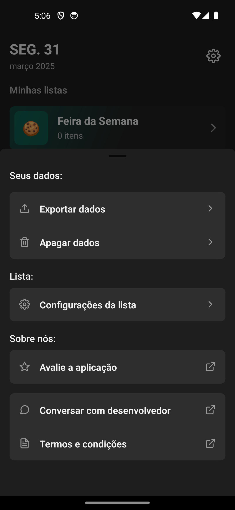

# Pango | Shopping List

<p align="center" id="menu">
  <a href="#about-the-project">About the Project</a> •
  <a href="#features">Features</a> •
  <a href="#tech-stack">Tech Stack</a> •
  <a href="#installation-and-local-run">Installation & Local Run</a> •
  <a href="#screenshots">Screenshots</a> •
  <a href="#documentation">Documentation</a>
</p>

## About the Project

Buble List é um aplicativo moderno de lista de compras que combina simplicidade com um design intuitivo e fluido. Ideal para quem quer manter suas compras organizadas com praticidade e estilo.

## Tech Stack

    •	Criação de listas de compras com nome, cor e ícone
    •	Adição de produtos com nome, quantidade e valor
    •	Edição rápida de produtos
    •	Visual moderno com suporte a temas
    •	Animações suaves para transições e interações
    •	Suporte a emojis nos nomes das listas

### Frontend

    •	React Native
    •	Expo
    •	React Navigation
    •	Reanimated 3
    •	Zustand (Gerenciamento de estado)
    •	SQLite (via expo-sqlite)

### Backend

    •	Local database com SQLite
    •	Persistência offline

### Deployment

    •	Disponível para Android via APK (em breve via Play Store)

---

## UI/UX

  <p align="center">
  
  
  
  </p>
  <p align="center">
  
  
  
  </p>
   <p align="center">
  
  
  
  </p>
     <p align="center">
  
  

  </p>

### Documentation

A documentação do projeto cobre:

    •	Estrutura de pastas
    •	Componentes principais
    •	Hooks personalizados
    •	Banco de dados SQLite
    •	Navegação
    •	Store com Zustand

## Estrutura de Pastas

```
src/
├── components/       → Componentes reutilizáveis (Input, Buttons, Sheets, etc)
├── database/         → Lógica de SQLite
├── store/            → Zustand stores
├── screens/          → Telas principais (Home, Edit, Add, etc)
├── hooks/            → Hooks customizados
├── assets/           → Ícones, fontes, imagens
```

## SQLite

    •	Tabelas:
    •	list: informações da lista (nome, cor, emoji, orçamento, data)
    •	product: produtos por lista (nome, quantidade, valor, status, etc)

## Componentes Reutilizáveis

    •	ProductInput: entrada de produto com botão de ação
    •	ThemedView / ThemedText: suporte a temas escuros/claro
